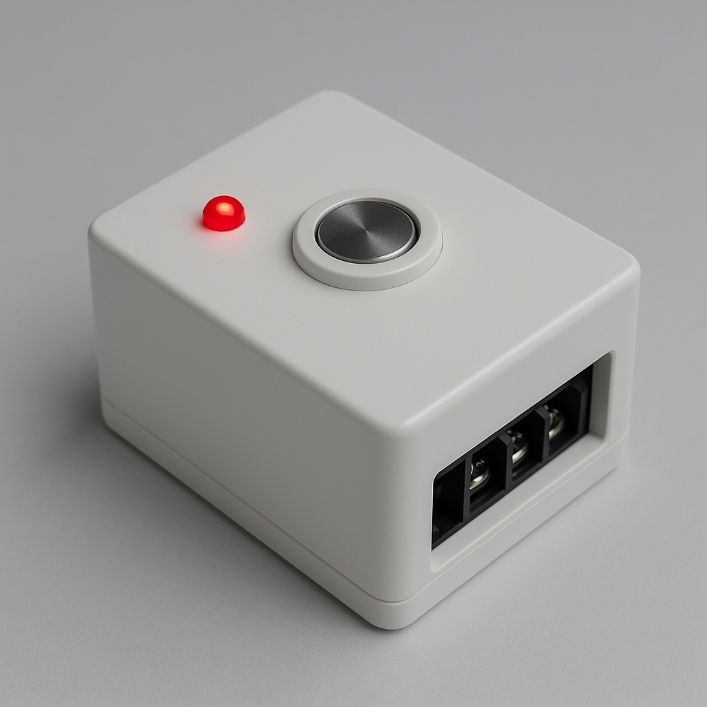

# 🔆 Automated Light Controller

A power-resilient embedded light controller with RTC-based scheduling and intelligent state restoration.

---

## 📘 Overview

This project is an AVR-based automated light controller designed to toggle lighting circuits (such as gate or outdoor lights) based on real-time clock (RTC) schedules. It ensures lights are switched ON/OFF at user-defined times and intelligently recovers their state after power failures using EEPROM storage.

It also supports manual override via a physical button, with safety debounce and interrupt delay logic.

---

## ✅ Features

- ⏰ **RTC-Based Scheduling**  
  Turns lights ON and OFF based on pre-programmed ON/OFF times.

- 💾 **EEPROM State Retention**  
  Recovers last known state across power outages, ensuring consistent behavior.

- 💡 **Manual Override**  
  Allows toggling light manually via a push-button (INT1 external interrupt).

- 🔄 **Graceful Recovery**  
  If the light was manually turned OFF before an outage, it stays OFF upon power restoration — even if the RTC schedule says otherwise.

- ✨ **PWM LED Indicator**  
  Fading red LED provides visual feedback or heartbeat during idle state.

- 🔌 **Fully Modular AVR Codebase**  
  Professionally split `.h`/`.c` structure for portability and readability.

---

## 🧠 How It Works

1. **RTC Module** tracks real-time and triggers two alarms:  
   - Light ON time  
   - Light OFF time  

2. **EEPROM** stores the latest manual or automated ON/OFF event with a timestamp.

3. **Upon boot**, the system:
   - Initializes timers, RTC, and interrupts.
   - Reads the last known state from EEPROM.
   - Compares stored timestamp with current time.
   - Sets light state accordingly.

4. **Manual button press** toggles the light and temporarily disables further interrupts (with a re-enable delay via timer logic).

---

## ⚙️ Hardware Requirements

- **Microcontroller**: ATmega328P  
- **RTC Module**: DS3231  
- **LED/PWM Driver**:For visual indicators
- **Push Button**: Connected to INT1 (PD3)  
- **Relay/Triac**: For switching the actual light/load  
- **EEPROM**: Internal to ATmega328P

---

## 📂 Project Structure

automated-light-controller/
├── include/ # All header files
├── src/ # Source (.c) files
├── platformio.ini # PlatformIO project config
├── README.md # This file
└── LICENSE # MIT License

---

## 🛠️ Build & Flash

This project uses [PlatformIO](https://platformio.org/).

```bash
# Install dependencies
platformio init --board ATmega328P

# Build the project
platformio run

# Upload to device
platformio run --target upload
Or open in VSCode + PlatformIO IDE and press ▶️ Build & Upload.

🔧 Configuration
Predefined ON/OFF times can be updated in code or written to EEPROM through serial or I2C interface extensions (not included here but pluggable).

📸 Screenshots
<p align="center">
  
</p>

🪪 License
MIT © Lakmal Weerasinghe